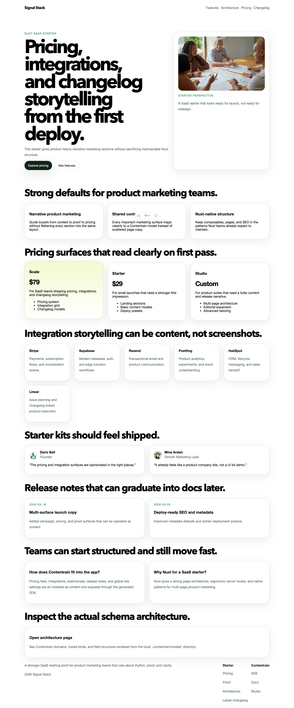
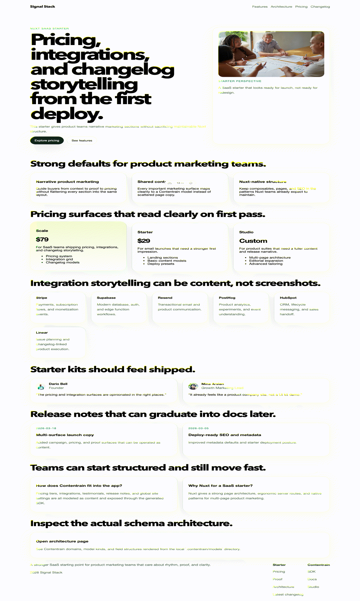

> Source of truth: this starter is exported from the `contentrain-starters` monorepo.
> Internal starter id: `nuxt-saas`.
# Contentrain Nuxt SaaS

SaaS starter focused on pricing, integrations, proof, and release storytelling.





## Contentrain Ecosystem

- SDK and CLI: [ai.contentrain.io/packages/sdk.html](https://ai.contentrain.io/packages/sdk.html)
- Product guides: [docs.contentrain.io](https://docs.contentrain.io/)
- Content operations UI: [studio.contentrain.io](https://studio.contentrain.io)

## Quick Start

```bash
pnpm install
pnpm dev
```

## Commands

- `pnpm dev`
- `pnpm check`
- `pnpm build`
- `pnpm preview`
- `pnpm deploy:netlify`
- `pnpm contentrain:generate`

## Demo routes

- `/`
- `/changelog/multi-surface-launch-copy`
- `/architecture`

## Contentrain

- Content models live in `.contentrain/`
- A server API route reads from `#contentrain` and feeds the Nuxt page with typed content
- Pricing tiers, integrations, testimonials, FAQ, changelog, navigation, footer, and SEO are all content-driven
- Changelog cards now link to a real internal route at `/changelog/[slug]`
- The starter stays aligned with Contentrain’s git-native architecture and keeps content, schema, and generated SDK output in one reviewable flow

## Deploy

- Netlify build command: `pnpm deploy:netlify`
- Netlify publish directory: framework-managed
- Standard local production build: `pnpm build`

## Netlify Project Creation

[](https://app.netlify.com/start/deploy?repository=https%3A%2F%2Fgithub.com%2FContentrain%2Fcontentrain-starter-nuxt-saas)

Use `pnpm dlx netlify-cli init` to connect the repository for continuous deployment, or `pnpm dlx netlify-cli link` if the site already exists.
